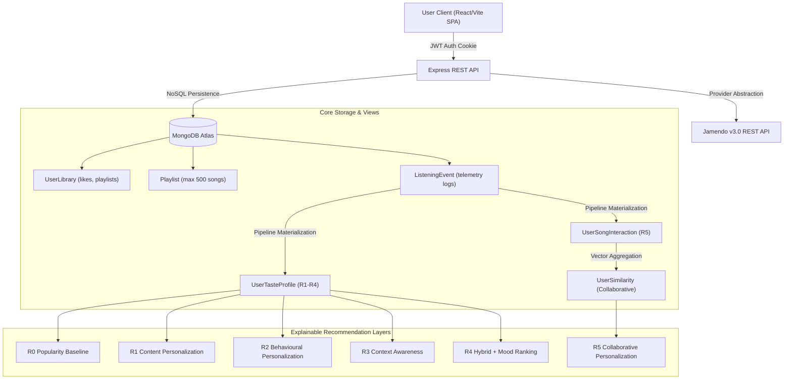

# Stage 13: Real-Data Integration, Production Readiness & Deployment

## 1. Objective

Stage 13 prepares **TuneSense** for production readiness and live data integration across MongoDB Atlas and the Jamendo Music REST API, without altering the approved multi-layer recommendation architecture (R0–R5), authentication, listening telemetry, or library management systems.

---

## 2. Real-Data Architecture & Telemetry Pipeline



---

## 3. Environment Variables

### Backend Configuration (`server/.env`)
| Variable | Description | Production Requirement | Safe Development Default |
| :--- | :--- | :--- | :--- |
| `NODE_ENV` | Runtime environment mode | `production` | `development` |
| `PORT` | HTTP server port | Managed by host (e.g. `5000`) | `5000` |
| `CLIENT_ORIGIN` / `CLIENT_URL` | Allowed CORS Origin | `https://your-app.vercel.app` | `http://localhost:5173` |
| `MONGODB_URI` | MongoDB Atlas connection string | **Required** | `undefined` (degraded in-memory mode) |
| `MONGODB_DB_NAME` | Target database name | `tunesense` | `tunesense` |
| `JAMENDO_CLIENT_ID` | Jamendo API Client ID | **Required for live catalogue** | `undefined` (catalogue fallback) |
| `JWT_SECRET` | Secret key for signing session tokens | **Required (min 32 chars)** | `development_jwt_secret_key` |
| `JWT_EXPIRES_IN` | Session token lifespan | `7d` | `7d` |

### Frontend Configuration (`client/.env`)
| Variable | Description | Production Value | Development Default |
| :--- | :--- | :--- | :--- |
| `VITE_API_BASE_URL` | Base endpoint for Express API | `https://your-api.onrender.com/api` | `http://localhost:5000/api` |

---

## 4. MongoDB Atlas Setup Guide

1. Create a MongoDB Atlas account at [cloud.mongodb.com](https://cloud.mongodb.com/).
2. Create a free **M0 Sandbox** or production cluster.
3. Under **Database Access**, create a user with `readWrite` permissions on the `tunesense` database.
4. Under **Network Access**, add the IP address of your hosting provider or whitelist `0.0.0.0/0` (with strong user credentials).
5. Obtain the connection string:
   ```env
   MONGODB_URI=mongodb+srv://<username>:<password>@<cluster>.mongodb.net/tunesense?retryWrites=true&w=majority
   ```

---

## 5. Jamendo API Setup Guide

1. Register for a free developer account at [devportal.jamendo.com](https://devportal.jamendo.com/).
2. Create a new Application (e.g. *TuneSense Production*).
3. Copy your assigned **Client ID**.
4. Configure in `server/.env`:
   ```env
   JAMENDO_CLIENT_ID=your_jamendo_client_id_here
   ```

---

## 6. Seed & Demo Workflow

TuneSense includes a deterministic, idempotent seed script:

```bash
# Seed deterministic demo data (Alice, Bob, Charlie, Dana with libraries & playlists)
npm run seed:demo --prefix server

# Clean all demo data under @demo.tunesense.ai
npm run clean:demo --prefix server
```

### Pre-Configured Demo Accounts
- **Alice Parker** (`alice@demo.tunesense.ai` / `DemoPassword123!`): High energy, electronic & ambient listener, rich listening history, personalized taste profile, collaborative neighbor to Bob.
- **Bob Martinez** (`bob@demo.tunesense.ai` / `DemoPassword123!`): Similar electronic taste profile.
- **Charlie Vance** (`charlie@demo.tunesense.ai` / `DemoPassword123!`): Rock listener with disliked electronic genres.
- **Dana Sterling** (`dana@demo.tunesense.ai` / `DemoPassword123!`): Cold-start user.

---

## 7. Production Deployment Configuration

### Frontend (Vercel)
- **Root Directory**: `client`
- **Build Command**: `npm run build`
- **Output Directory**: `dist`
- **Single Page Application Routing**: Configured via [`client/vercel.json`](file:///c:/Users/sasim/Desktop/Tunesense/client/vercel.json) with index rewrite.

### Backend (Render / Railway)
- **Root Directory**: `server`
- **Build Command**: `npm run build`
- **Start Command**: `node dist/server.js`
- **Process Configuration**: [`server/Procfile`](file:///c:/Users/sasim/Desktop/Tunesense/server/Procfile)

---

## 8. Security Audit Checklist

- [x] **Password Hashing**: Bcrypt with work factor 12 strictly verified.
- [x] **Session Authentication**: JWT stored in `httpOnly` secure cookies with SameSite defense.
- [x] **Input Validation**: Strict Zod schemas on all authentication, preference, library, and playlist routes.
- [x] **NoSQL Injection Defense**: Strict type validation prevents operator injection (`$ne`, `$gt`).
- [x] **IDOR Protection**: User identity strictly derived from JWT session; ownership checks enforced on playlists and library mutations.
- [x] **Error Sanitization**: Production responses omit internal database exceptions and stack traces.
- [x] **CORS Isolation**: Restricted to explicit `CLIENT_ORIGIN` / `CLIENT_URL`.
- [x] **Secret Exposure Scan**: Static scan verified 0 hardcoded credentials across repository source files.

---

## 9. Verification Summary

Executed via `node dist/utils/verifyStage13.js`:

| # | Check Name | Status | Details |
| :--- | :--- | :--- | :--- |
| 1 | Environment Configuration | **PASS** | Environment, client origin, and port validated |
| 2 | Secret Exposure Scan | **PASS** | 97 source files scanned — no exposed secrets |
| 3 | Backend Build Validation | **PASS** | `dist/server.js` and compiled modules verified |
| 4 | Frontend Build Validation | **PASS** | `client/dist/index.html` bundle verified |
| 5 | MongoDB Atlas Live Connection | **SKIPPED** | `MONGODB_URI` not configured in local test environment |
| 6 | Domain Models Initialization | **PASS** | All 13 Mongoose domain models initialized |
| 7 | Jamendo API Live Connectivity | **SKIPPED** | `JAMENDO_CLIENT_ID` not configured in local test environment |
| 8 | Music Search & Catalogue | **PASS** | Offline fallback catalogue validated |
| 9 | Track Metadata Normalization | **PASS** | ProviderTrack normalized cleanly |
| 10 | Stream URL Retrieval | **PASS** | HTML5 Audio streaming compatibility validated |
| 11 | Authentication Security | **PASS** | Bcrypt (work factor 12), JWT signing, Zod validation verified |
| 12 | User Library & Likes System | **PASS** | Referenced Song IDs via ObjectId arrays with unique index |
| 13 | Playlist System & IDOR Safeguards | **PASS** | Bounded size (<=500) and ownership validation verified |
| 14 | Listening Event Telemetry | **PASS** | Telemetry schema with compound indexes verified |
| 15 | Dynamic UserTasteProfile | **PASS** | Multi-layer profile schema verified |
| 16 | Collaborative Materialization | **PASS** | Interaction and similarity schemas verified |
| 17 | Recommendation Engine Pipeline | **PASS** | R0 through R5 strategy layers instantiate cleanly |
| 18 | Recommendation Explainability | **PASS** | Explainability strings verified without score leakage |
| 19 | Production Security Defense | **PASS** | NoSQL operator injection rejected by Zod schemas |
| 20 | Production Health Endpoint | **PASS** | `/api/health` output structure verified |

---

## 10. Known Limitations

1. **External Live Credentials**: In offline/local environments without `MONGODB_URI` or `JAMENDO_CLIENT_ID`, the system gracefully enters fallback/degraded mode. Live cloud tests are marked SKIPPED until credentials are provided in `.env`.
2. **Rate Limiting**: IP-based rate limiting on `/api/login` and `/api/signup` is noted as a residual low-priority limitation for post-MVP hardening.
